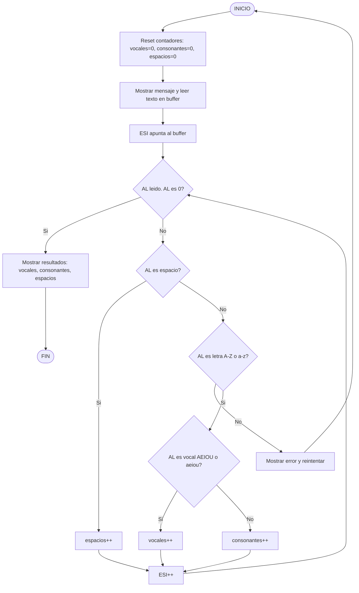

# Contador de Vocales y Consonantes en Ensamblador

Proyecto de la asignatura **Arquitectura de Computadores**.

Este programa, escrito en **ensamblador NASM (32-bit)** y ejecutado en **SASM**, permite introducir una cadena de texto y calcula:

* Número de **vocales**
* Número de **consonantes**
* Número de **espacios**

El programa valida que el texto contenga **solo letras (A-Z, a-z) y espacios**.
Si se introduce cualquier otro carácter, muestra un error y solicita nuevamente la entrada.

---

# Funcionamiento del programa

1. El programa solicita al usuario que introduzca un texto.
2. La cadena se guarda en un **buffer de 100 caracteres**.
3. Se recorre la cadena carácter por carácter usando un puntero.
4. Para cada carácter se realiza:

   * Validación ASCII
   * Clasificación del carácter:

     * Vocal
     * Consonante
     * Espacio
5. Si se detecta un carácter inválido:

   * Se muestra un mensaje de error
   * El programa vuelve a solicitar el texto.
6. Si el texto es válido, se muestran los resultados.

---

# Estructura del proyecto

```
contador_vocales_consonantes_sasm
│
├── docs
│   └── fase2_diseño.md        # Diseño técnico del programa
│
├── src
│   ├── fase2
│   │   └── main_skeleton.asm  # Estructura del programa
│   │
│   └── fase3
│       └── main.asm           # Implementación completa
│
├── README.md
└── LICENSE
```

---

# Tecnologías utilizadas

* **Lenguaje:** Ensamblador x86
* **Sintaxis:** NASM
* **Entorno:** SASM
* **Macros de entrada/salida:** `io.inc`

---

# Compilación y ejecución

El programa está pensado para ejecutarse en **SASM**.

Pasos:

1. Abrir `src/fase3/main.asm` en SASM
2. Compilar el programa
3. Ejecutar
4. Introducir una cadena de texto cuando se solicite

---

# Ejemplo de ejecución

Entrada del usuario:

```
hola mundo
```

Salida:

```
Vocales: 4
Consonantes: 5
Espacios: 1
```

Si el usuario introduce caracteres inválidos:

```
hola123
```

El programa mostrará:

```
ERROR: solo se permiten letras (A-Z, a-z) y espacios.
```

y pedirá el texto nuevamente.

---

# Conceptos de arquitectura utilizados

El proyecto utiliza varios conceptos fundamentales de **Arquitectura de Computadores**:

* Uso de **registros (EAX, ESI, AL)**
* Gestión de **memoria (.data y .bss)**
* Recorrido de strings mediante punteros
* Comparaciones ASCII
* Uso de **saltos condicionales**
* Control de flujo mediante etiquetas

---

## Diagrama de funcionamiento


# Autor

Daniel, Alexander

Proyecto académico para la asignatura **Arquitectura de Computadores**.
